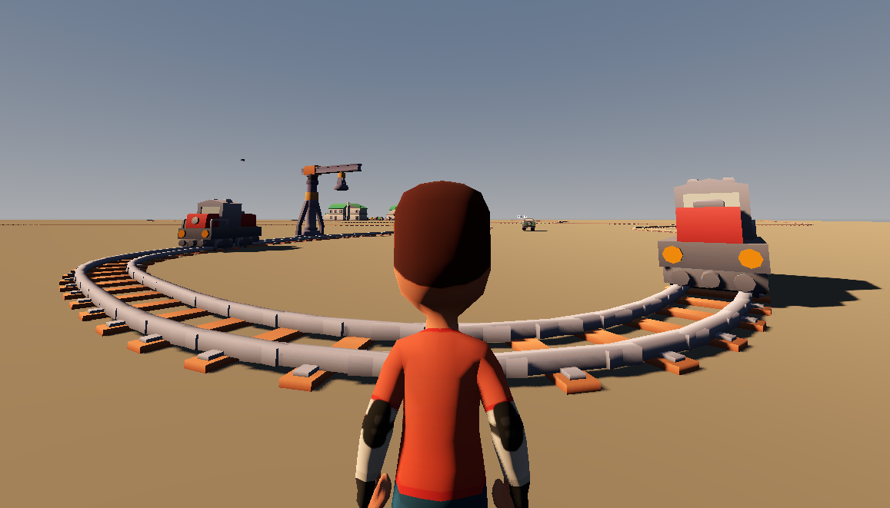
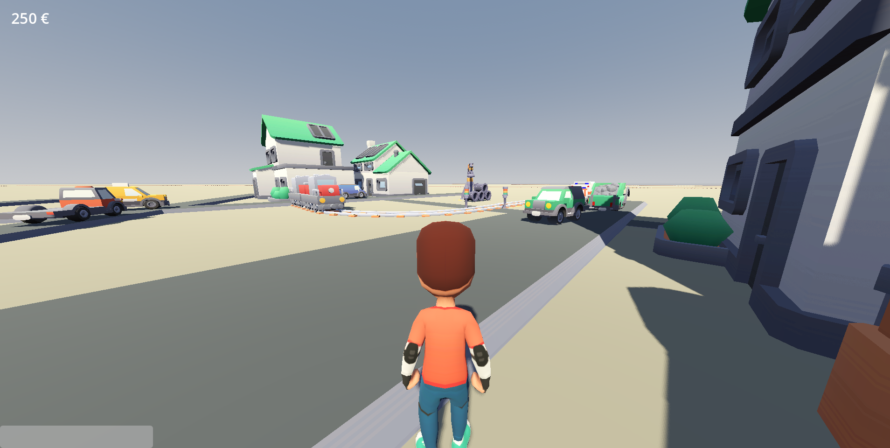
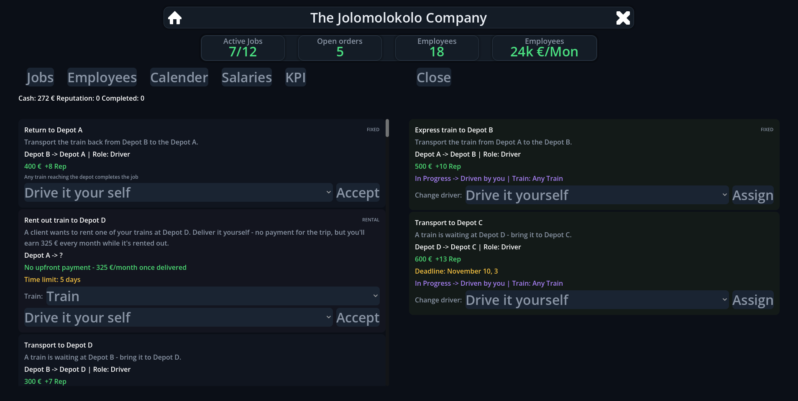

# Trackenomics

### The Name is the Programm!

**Trackenomics** is a train management game where you start with a small railway company and slowly build it into something bigger.

Buy trains, hire employees, transport cargo, improve your equipment and try to make your company more successful.

And don't forget about your personal life.

Because running a railway company is only one part of the game.

---

## About the Game

I am making Trackenomics because I really like trains.

I have always found trains and railways interesting, and I wanted to make a game where I could combine that interest with management and simulation.

Trackenomics is my **first 3D game** and is still very much a work in progress.

I have currently spent around **150 hours** working on the game, but there is still a lot left to do. There are bugs to fix, systems to finish and many things I still want to learn.

I am building the game mostly by myself while learning new things along the way.

---

## What can you do?

The basic idea is simple:

* Start your own small railway company
* Buy and operate trains
* Hire employees
* Transport and exchange cargo
* Improve your trains and equipment
* Make your transport faster and more efficient
* Grow your company
* Deal with problems on your railway
* And try to keep your personal life together

The goal is to slowly build up your company and make it better over time.

---

## Current Development

The game is still in development.

Right now, I am mainly working on the **job system**, which is one of the bigger systems in the game.

There are also still quite a few bugs and unfinished parts. Since this is my first 3D game, I am learning a lot while developing it, so some things may change during development.

I would rather slowly improve the game than rush it.

---

## Planned Features

There is still a lot I want to add.

### Cargo and Wagons

The basic systems for cargo and wagons are already prepared.

The plan is to make different types of cargo and wagons an important part of running your railway.

### A proper Map

The current map is still very much a work in progress.

I am currently learning **Blender** so I can create more of the environment myself and build a proper map for the game.

### More Quality of Life

I also want to improve the smaller things that make the game easier and nicer to play.

Some planned improvements include:

* Better information displays
* More detailed train information
* Better company management
* More useful UI elements
* More visual feedback
* Better overview of your railway

### Breakdowns and Problems

Things should not always work perfectly.

I want to add problems such as:

* Broken trains
* Broken tracks
* Other railway problems
* More things that can go wrong during normal operation

You will have to deal with these problems and keep your railway running.

And there are many more ideas that I want to add later.

---

## Roadmap

The roadmap is still changing as development continues, but these are some of the bigger things currently planned:

* [x] Basic railway systems
* [x] Train systems
* [x] Company basics
* [x] Initial job system
* [ ] Finish job system
* [ ] Cargo system
* [ ] Wagons
* [ ] Better / bigger map
* [ ] More UI and information
* [ ] Train breakdowns
* [ ] Track problems
* [ ] More Quality of Life features
* [ ] More content and systems
* [ ] Steam release

This list is not final and will probably change quite a few times.

---

## Why am I making this?

There isn't really a complicated reason.

**I like trains.**

I think railways are interesting and there are a lot of different systems working together behind something that can look quite simple from the outside.

I wanted to make my own game around that idea.

Trackenomics is also a learning project for me. It is my first 3D game, so I am learning things like 3D modelling, game design, programming and a lot of other stuff while making it.

It is far from finished, but seeing the game slowly grow after every few hours of work is what keeps me going.

---

## Screenshots

More screenshots will be added as development continues.

---

## Follow the Development

You can find the current version and development updates here:

**itch.io:** [Trackenomics on ITCH.IO](https://jolomolokolo.itch.io/trackenomics)

**Steam:** Coming later

If you play the game, feedback and bug reports are very welcome. They help me find things I might have missed and make the game better.

---

## Development Status

**Status:** In Development

**Developer:** Solo / Indie Developer

**First 3D Game:** Yes

**Development Time:** ~150 hours

**Current Focus:** Job System

**Engine:** GODOT

---

Thanks for checking out Trackenomics.

There is still a long way to go, but I am looking forward to seeing where this project ends up.

Thx for Macondo and HackClub !

Out - for now: Jolomolokolo

**More trains. More cargo. More problems.**
